## MLSys'22 Artifact Evaluation

### Evaluation Overview
**Artifacts Available**:
- Graphiler is available in: https://github.com/xiezhq-hermann/graphiler
- Should I upload a copy to zenodo for archival purpose?

**Artifacts Functional**:
- *Documentation*: multiple README files along with comments in code cover how to build, benchmark Graphiler and understand the key design and implementation.
- *Completeness*: this code repo includes all the key components of Graphiler described in the paper.
- *Exercisability*: under the artifacts folder, you can find the script and data to reproduce the experiements.

**Results Reproduced**:

To reproduce the main results presented in our paper, we provide a Docker image and an AWS p3.2xlarge instance with the same configurations as we used in paper evaluation.

### Build Graphiler and prepare environment
See https://github.com/xiezhq-hermann/graphiler#build-graphiler-and-get-started.

### Reproduce main experiment result
**End-to-end Performance** (Figure 5 and 6):

For docker users:
```
mkdir -p output
docker run --gpus all -i -t -v $(pwd)/output:/root/graphiler/output graphiler artifact/run_all.sh
# The repeat time of each experiment in docker was set to `50` by default.
```
For locally built:
```
mkdir -p output
# the repeat time of experiment, set it to any value as you need
export REPEAT=50

# run all experiments and visualize results
bash $GRAPHILER/artifact/run_all.sh

# You can also benchmark each model individually, e.g.,:
python $GRAPHILER/examples/GAT/GAT.py all 0
bash $GRAPHILER/artifact/visualize.sh GAT
```
Running time and memory comsuption comparison figures for every model with different datasets will be generated in `output`.

**Breakdown Analysis** (Figure 7-9, Table 2):

For docker users:
```
mkdir -p output
docker run --gpus all -i -t -v $(pwd)/output:/root/graphiler/output graphiler artifact/run_breakdown.sh
```
For locally built:
```
mkdir -p output
bash $GRAPHILER/artifact/run_breakdown.sh

# You can also run breakdown analysis for GAT and HGT separately, e.g.,:
python $GRAPHILER/examples/GAT/GAT.py breakdown 0
bash $GRAPHILER/artifact/visualize.sh GAT_breakdown
```
Breakdown analysis of running time and memory comsuption comparison figures for `GAT` and `HGT` with different datasets will be generated in `output`.

### Performance Reference
<p align="center">

<b>GCN</b>

  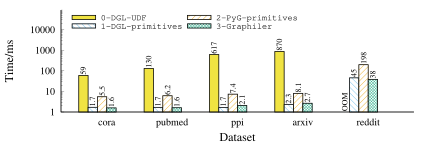
  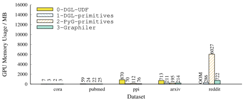

<b>GAT</b>

  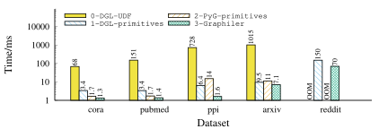
  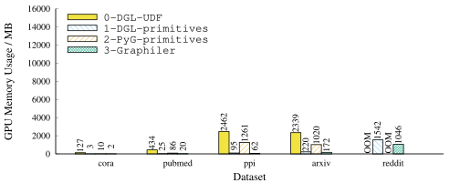

<b>RGCN</b>

  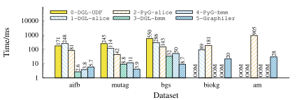
  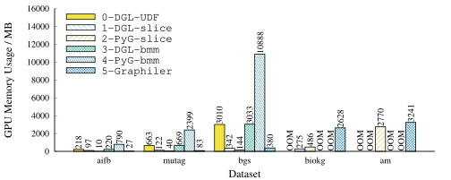

<b>HGT</b>

  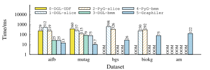
  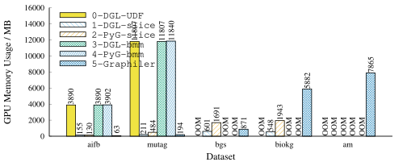

<b>GAT Breakdown</b>

  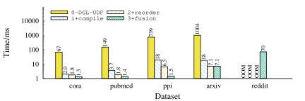
  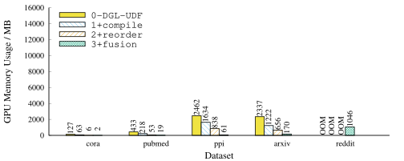

<b>HGT Breakdown</b>

  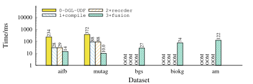
  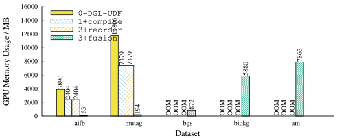

</p>